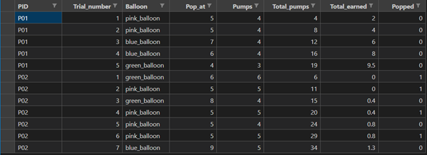
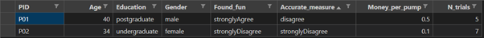
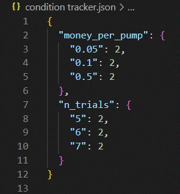

# Balloon Game README

<h2> Experimental Overview: 
</h2>

In this experiment, we are evaluating the effectiveness of the balloon game as a psychometric tool. The balloon game is one of the most popular tests companies use to measure their candidates' risk-taking behaviour. In each round, participants are presented with one of three types of balloons each with a different pop range. They are told that they will earn 5p every time they pump the balloon. However, if they pump the balloon too much it will pop, and they will lose everything they have earned in the round. At any point in the round, they may bank the balloon. This moves them on to the next balloon and adds their round’s earnings to their total. Candidates with high risk-taking behaviour are more likely to pop the balloons while those with low risk-taking behaviour will bank the balloons early. Hence, extreme candidates at either end will perform poorly.

Despite the balloon game's popularity, little is known about it. Therefore, in this experiment, we will be investigating whether the number of trials and money earned per pump affects how many times the participants pump the balloon. Furthermore, we will be investigating whether participants found the game fun and whether they believe that it accurately measures their risk-taking behaviour.  

<h2>Methods
</h2>

**Design**

This study has a between-groups design with two independent variables. The first independent variable is the number of trials. This has three levels (five trials, six trials or seven trials). The second independent variable is the amount of money earned per pump. This also has three levels (5p, 10p or 50p). The dependent variables in this study are the amount of money earned and how many times the balloon is popped.

**Procedure**

First, participants will enter their participant ID. They will then provide their consent and demographical information. Next, they will be given a brief description of the balloon game and complete a tutorial. After the tutorial, they will be given the option to start the balloon game or replay the tutorial. Once the balloon game is over, they will be asked to rate how fun they found the game and how accurately it measures their risk-taking behaviour on a 5-point Likert scale. To help them with the latter question they will be presented with a line graph showing the number of times they pumped each balloon. After they give their feedback, they will be debriefed. 

<h2>Experimenter Manual
</h2>

<b><i>Running and editing the experiment</i></b>

Run [main.py](main.py) to start the experiment. Edit [experiment_config.py](experiment_config.py) to customise the experiment. This file mainly allows you to edit the conditions and control the balloon’s bobbing and inflating animations. Read the comments in the file for more info. 

<b><i>Output</i></b>

The data is stored in a folder called Data. This will contain two files, “trial_data.csv” (see figure 1) and “participant_data.csv” (see figure 2). "trial_data.csv" contains the data from the balloon game. "participant_data.csv" contains the participants' demographical information alongside which conditions they were in and their feedback on the game. “condition tracker.json” keeps track of how many participants have been in each condition (see figure 3). 

<u>Trial data</u>

* **PID:** Participant ID

* **Trial_number**: Trial Number

* **Balloon**: Balloon type

* **Pop_at:** Pump the balloon pops at

* **Pumps:** Number of times the participant pumped the balloon

* **Total Pumps:** Number of pumps in the entire experiment thus far

* **Total Earned:** Total amount of money (£) the participant has earned so far. 

* **Popped:** Binary value. 1 = balloon was poppped. 0 = balloon wasn't popped

<u>Participant Data</u>

* **PID:** Participant ID

* **Age:** Participant's age in years. 

* **Education:** Highest level of education achieved. Highschool/ undergraduate/ postgraduate

* **Found_fun:** Response to the statement “The balloon game is fun”.

* **Accurate_measure:** Response to the statement "The balloon game accurately measured my propensity to take risks. 

**Figure 1**

*Trial data csv*

**Figure 2**

*Participant data csv*

**Figure 3**

*Condition tracker JSON*

*Note.* The JSON contains a dictionary with two dictionaries nested in it. The names of the nested dictionaries refer to an independet variable. The keys refer to a condition and the values represent the number of participants in them. 
